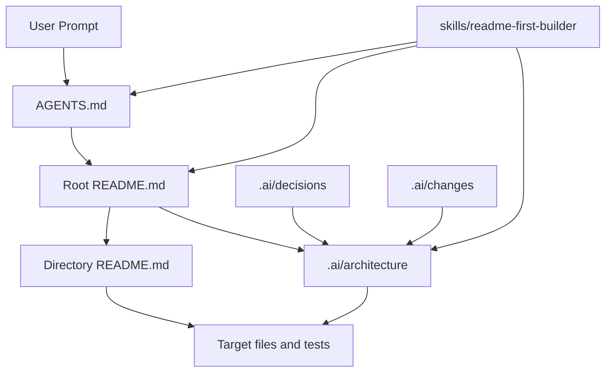

# README First Context Map

> Status: current architecture entry, 2026-06-05.

README First 是一套面向 AI 协作开发的项目上下文协议。它的核心不是增加文档数量，而是让每类文档承担稳定、可验证、可维护的职责。

## Top-Level Context Modules

| 模块 | 职责 | 主要接口 | 验证方式 |
|---|---|---|---|
| `AGENTS.md` | 全局 Agent 行为协议 | 读取顺序、不确定性压缩、增删改查规则、记录规则 | 人工审阅、与 README 和 `.ai/architecture` 交叉检查 |
| `README.md` | 项目地图和原则说明 | 系统组成、核心原则、落地路线、skill 入口 | 链接和路径检查 |
| 目录级 `README.md` | 局部上下文契约 | 目录职责、核心文件、依赖边界、验证方式 | 与当前目录结构和代码事实比对 |
| `.ai/architecture/` | 当前稳定架构知识层 | 模块地图、依赖边界、文档契约、当前状态 | `git diff --check` 与路径引用检查 |
| `.ai/changes/` | 单次变更记录 | 变更原因、范围、假设、验证和后续注意事项 | 文件名日期、记录内容完整性 |
| `.ai/decisions/` | 长期决策记录 | 背景、决策、影响和后续约束 | 与当前架构文件一致性检查 |
| `skills/readme-first-builder/` | 可复用初始化/升级能力 | `SKILL.md`、canonical source reference、agent metadata | 与根协议和 README 同步检查 |

## Context Flow

## Boundary Notes

- `AGENTS.md` 是行为协议入口；它可以引用 `.ai/architecture`，但具体架构说明不应塞回 `AGENTS.md`。
- 根 `README.md` 面向人类和 Agent 解释系统组成；它应指向 `.ai/architecture`，但不承载所有架构细节。
- 目录级 README 只描述对应目录的当前稳定契约；跨目录通用规则应上移到根 README 或 `.ai/architecture`。
- `.ai/changes/` 记录“这次为什么改”；`.ai/architecture/` 记录“现在系统是什么样”；`.ai/decisions/` 记录“为什么长期选择这样”。
- readme-first-builder skill 是对外复制协议的工具，必须跟随 canonical source 更新，但不应替代目标项目自己的 `AGENTS.md`。
