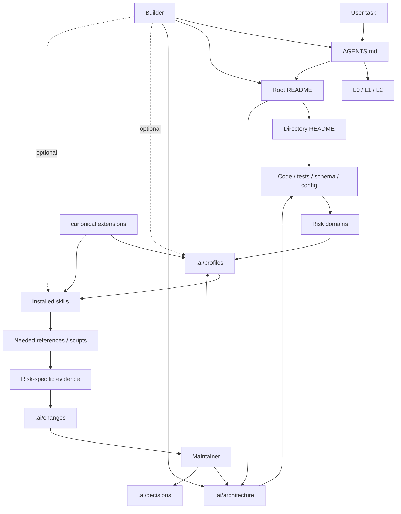

# README First Context and Capability Map

> 更新于:2026-08-02

README First v2.2 是一套面向 AI 协作开发的上下文、风险路由和证据协议。它不追求文档数量，而是让每类文档和 Skill 承担稳定、可验证、可维护的职责。

## Top-Level Modules

| 模块 | 职责 | 主要接口 | 验证 |
|---|---|---|---|
| `AGENTS.md` | 全局行为协议 | L0/L1/L2、读取、不确定性、风险路由、记录 | 与模板和 VERSION 同步 |
| 根 `README.md` | 项目地图和原则 | 系统组成、流程、能力包入口 | 路径与内容审阅 |
| 目录 README | 局部上下文契约 | 职责、边界、核心文件、验证 | 与目录事实比对 |
| `.ai/architecture/` | 当前稳定架构 | 模块地图、边界、Profile/Skill 架构 | repository validator |
| `.ai/profiles/` | 目标项目本地风险路由 | 触发、风险领域、不变量、证据、Skill 绑定 | `check-profiles.py` |
| 项目 `skills/` | 专业执行工作流 | SKILL、references、scripts、examples | Skill frontmatter 与项目测试 |
| `.ai/changes/` | 单次变更证据 | 原因、风险、假设、结果 | 模板字段和证据抽查 |
| `.ai/decisions/` | 长期选择原因 | 背景、决策、影响、非目标 | 与当前架构一致 |
| canonical `extensions/` | 可选能力包发布 | PROFILE + Skill | repository validator |
| Builder | 初始化、升级、候选发现 | 模板、热点扫描、可选安装 | fixtures + sync check |
| Maintainer | 巡检、压缩、沉淀、校准 | scripts + maintenance workflow | fixtures + reports |
| `VERSION` / `migrations/` | 协议演进 | 版本印记与升级清单 | migration chain |

## Context and Capability Flow

## Boundary Notes

- 任务级别管理流程重量，风险领域管理专业能力；二者不能互相替代。
- Profile 是项目本地路由契约；Skill 是跨项目复用工作流。
- `extensions/` 是 canonical 发布目录，不属于所有下游项目的最小系统。
- Scanner 只产生候选线索；finding 必须回到项目事实和运行证据。
- 培训手册只在 Mentor 或明确培训任务中加载。
- changes 记录“这次为什么、风险和证据”；architecture 记录“现在是什么”；decisions 记录“为什么长期这样选”。
