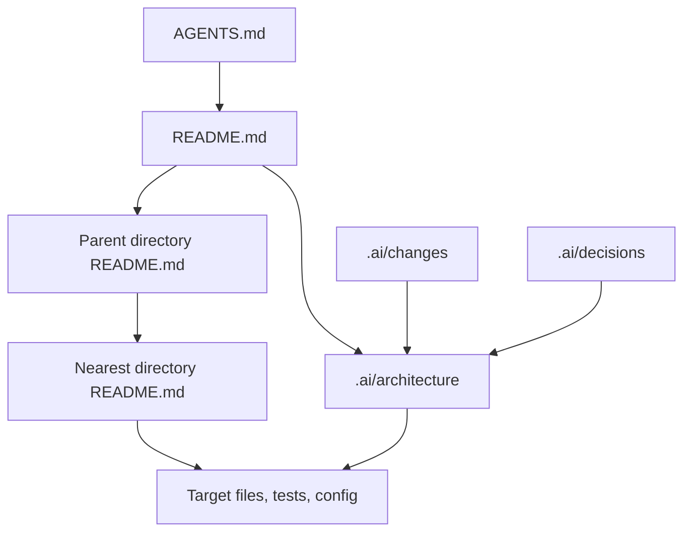

# README First Dependency Boundaries

> Status: initial stable boundary set, 2026-06-05.

本文档定义 README First 文档之间的读取顺序、优先级和不可替代关系。

## Intended Reading Direction

## Priority Rules

| 规则 | 原因 |
|---|---|
| `AGENTS.md` 的全局行为规则优先级最高 | 保证所有 Agent 先遵守同一执行协议 |
| 最近的目录 README 优先于上级目录 README | 局部目录契约更接近目标文件 |
| `.ai/architecture/` 解释跨目录长期架构 | 避免把跨目录规则散落到多个局部 README |
| `.ai/decisions/` 解释历史原因，不直接覆盖当前文件事实 | 决策可能过时，当前事实应以 README、代码和测试为准 |
| `.ai/changes/` 解释单次变更，不作为稳定 API 文档 | 变更记录是历史线索，不是当前契约 |

## Non-Substitution Rules

- 不用根 `README.md` 替代目录 README；根 README 只提供项目地图。
- 不用目录 README 替代 `.ai/architecture`；目录 README 不应承载跨项目架构百科。
- 不用 `.ai/architecture` 替代 `.ai/decisions`；当前状态和历史决策原因要分开。
- 不用 `.ai/changes` 替代 git diff 或 commit；它记录原因、假设和验证，不记录完整补丁。
- 不用 readme-first-builder skill 替代目标项目上下文；初始化完成后，目标项目自己的 `AGENTS.md` 和 README 是本地权威。

## Conflict Handling

当文档与实际文件冲突时：

1. 指出冲突位置。
2. 判断是文档过时、实现偏离，还是任务需要更新长期约定。
3. 修正当前任务范围内的最小必要文件。
4. 在 `.ai/changes/` 记录修正原因。
5. 若冲突暴露长期架构选择，新增或更新 `.ai/decisions/`。
