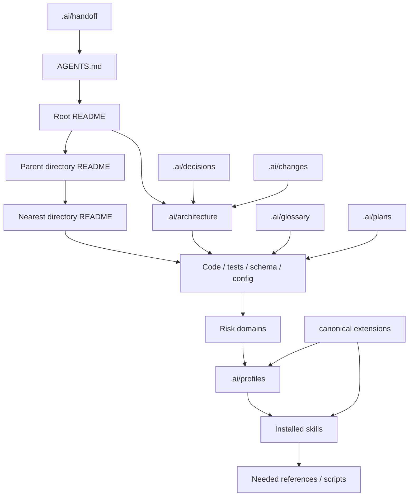

# README First Dependency Boundaries

> 更新于:2026-08-02

## Intended Reading Direction

## Priority Rules

| 优先级 | 原因 |
|---|---|
| 用户明确指令 | 当前任务目标的最高来源，但不能要求伪造事实或证据 |
| 项目 `AGENTS.md` | 全局执行和风险路由协议 |
| 最近目录 README | 最接近目标文件的局部契约 |
| 上级目录 README | 提供更宽模块边界 |
| 项目本地 `.ai/profiles/` | 对通用风险能力进行项目特化 |
| 已安装通用 Skill | 提供专业工作流，不了解全部项目事实 |
| Skill references / 示例 | 仅在当前步骤需要时加载 |
| 根 README / 通用建议 | 项目地图和背景，不覆盖更具体契约 |

代码、测试、schema、配置和真实运行结果是当前行为事实。文档冲突时要指出并修正最小必要范围。

## Non-Substitution Rules

- 根 README 不替代目录 README。
- 目录 README 不替代 architecture。
- architecture 不替代 decisions。
- changes 不替代 git diff 或稳定 API 文档。
- Profile 不替代项目代码、权限模型、schema 或测试。
- Skill 不替代 Profile 的项目本地触发和命令。
- Scanner 不替代 finding 证据。
- Builder 不替代目标项目的日常 `AGENTS.md`。
- Maintainer 不替代普通任务执行或业务代码修复。
- canonical `extensions/` 不自动成为下游最小系统。

## Conflict Handling

1. 指出冲突位置和涉及风险领域。
2. 判断是文档过时、Profile 漂移、Skill 不适配，还是实现偏离。
3. 以项目事实和更具体规则为优先，做最小必要修正。
4. changes 记录原因、假设和验证。
5. 长期选择写 decisions；当前稳定结果同步 architecture / Profile。
